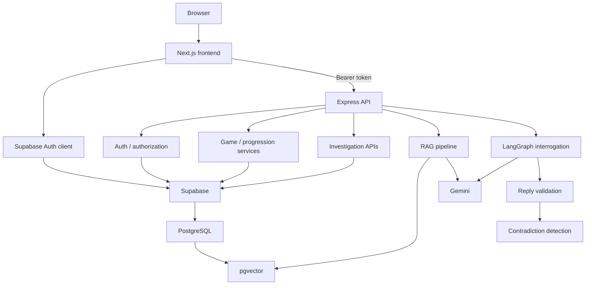
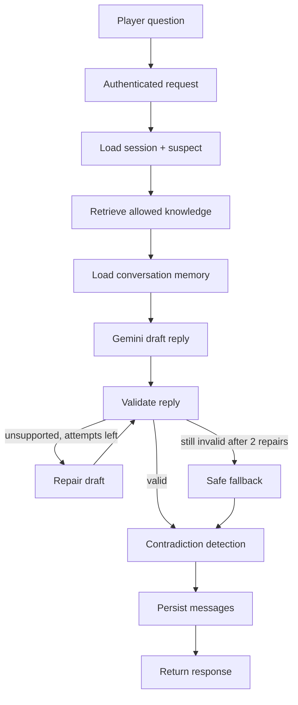
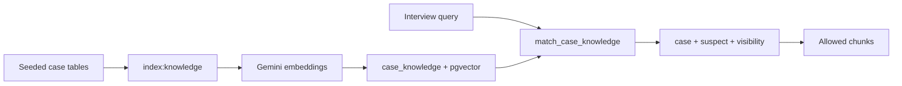
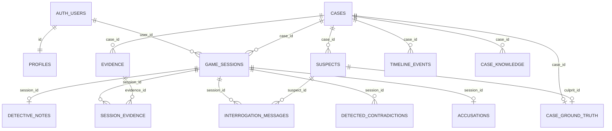

# MysteryBox

**An AI-powered interactive detective archive.** Players open case files, interrogate suspects, connect evidence, surface contradictions, and seal a final accusation — while the LLM never owns the truth of the case.

---

## 1. Project Overview

MysteryBox is a full-stack investigation game. Each case is a self-contained mystery: a victim, four suspects, a timeline, a drawer of evidence, and a locked solution stored only on the server.

It was built to explore a hard design problem: how to use generative AI for character and conversation without letting the model invent facts, leak the solution, or decide who is guilty.

The interesting engineering is the split. Gemini, RAG, and LangGraph make suspects feel present and consistent. PostgreSQL, Express, and deterministic scoring keep identity, progression, ownership, and the official solution out of the model’s hands.

The stack combines:

- full-stack TypeScript (Next.js frontend, Express API)
- generative AI for suspect dialogue
- RAG over case knowledge in pgvector
- LangGraph orchestration for interrogation
- persistent, per-user game state
- Supabase Auth and Row Level Security
- backend-enforced case progression
- deterministic culprit checks and scoring

The language model enhances interrogation. It does **not** control core game truth.

---

## 2. Key Features

| Feature | What it does |
| --- | --- |
| Cinematic archive | A Three.js / React Three Fiber desk and case-opening experience, with Framer Motion throughout the UI |
| Three playable cases | Published mysteries with their own suspects, evidence, timelines, and knowledge graphs |
| Sequential unlocking | `#001 → #002 → #003`, enforced on the API, not only in the UI |
| AI interrogation | Authenticated interviews scoped to the current case, suspect, and session |
| Conversation memory | Prior interview turns are loaded into the LangGraph workflow before a reply is generated |
| RAG-grounded replies | Suspect speech is retrieved from case-scoped embeddings, not a free-form prompt dump |
| LangGraph validation | Unsupported people, times, and solution leaks are rejected; replies can be repaired or replaced |
| Contradiction detection | Meaningful conflicts between a statement and the allowed record can be flagged and stored |
| Evidence & timeline | Discoverable files, public timeline marks, and per-session discovery state |
| Evidence board | An interactive board (`@xyflow/react`) for linking people and files |
| Detective notes | Per-session notes persisted on the server |
| Persistent progress | Sessions, discoveries, interviews, and accusations survive refresh and a new device |
| Final accusation | Name, motive, method, evidence, and reasoning are sealed once per session |
| Deterministic culprit check | Guilt is compared to stored ground truth, not to an LLM vote |
| Scoring & rank | Culprit, evidence, motive, and reasoning scores; career rank on the profile |
| Detective profile | Completed cases, accuracy, average score, current desk, recently solved |
| Supabase Auth | Email and password; Bearer tokens on API calls; a one-hour client session lifetime |
| User-specific sessions | Investigations are owned by `auth.users`; another detective cannot open your file |
| Row Level Security | User-owned tables and ground truth are locked down for anon/authenticated roles |
| Cross-case RAG isolation | Retrieval always filters on `case_id`; one mystery cannot answer for another |

---

## 3. Cases

Premises only. Culprits, hidden motives, methods, and official solutions are not described here.

### Case #001 — The Last Guest at Blackwood Manor

A private supper at Blackwood Manor, 1928. The host is found in the conservatory before the last course. Three familiar faces were invited. A fourth guest was not on the original card.

### Case #002 — The Dead Frequency

Station Vox-9, a private experimental shortwave room in Limehouse, 1931. A midnight broadcast drops into silence, then a repeating tone. The founder is found inside the locked transmission room. The door log says nobody entered. Someone still altered what the station recorded.

### Case #003 — The Passenger Who Never Boarded

An overnight first-class sleeping car from Paris toward Vienna, 1933. A berth is found locked in the morning. The luggage is present. The ticket is punched. Two passengers remember the man in the corridor. Railway paper filled from the ticket bureau says he was aboard. A station plate suggests he may never have boarded at all.

### Progression

```
Case #001  →  complete  →  Case #002  →  complete  →  Case #003
```

Case #001 is available to every authenticated detective. Completing a session (a valid sealed accusation, whether or not the name is right) unlocks the next file for **that user only**. The archive UI reflects those states (`locked`, `available`, `in_progress`, `completed`). Starting a locked case without the prior completion is rejected by the backend.

---

## 4. Tech Stack

### Frontend

| | |
| --- | --- |
| Framework | Next.js 16, React 19, TypeScript |
| Styling | Tailwind CSS 4, Framer Motion |
| 3D | Three.js, React Three Fiber, Drei |
| Board | `@xyflow/react` |
| Auth client | `@supabase/ssr`, `@supabase/supabase-js` |

### Backend

| | |
| --- | --- |
| Runtime | Node.js, Express 5, TypeScript |
| Validation | Zod |
| HTTP | Helmet, CORS, Morgan |

### Database & authentication

| | |
| --- | --- |
| Platform | Supabase (PostgreSQL) |
| Vectors | pgvector (`vector(768)`, HNSW cosine index) |
| Auth | Supabase Auth (email / password) |
| Security | Row Level Security on user-owned tables and ground truth |

### AI

| | |
| --- | --- |
| Chat | Gemini (`gemini-3.5-flash` by default; optional `GEMINI_CHAT_MODEL`) |
| Embeddings | `gemini-embedding-001`, 768 dimensions |
| Orchestration | LangGraph (`@langchain/langgraph`) |
| Retrieval | `match_case_knowledge` RPC over `case_knowledge` |

### Deployment

There is no committed production host config in this repository (no `vercel.json`, no deploy workflow). The Next.js app is compatible with Vercel-style hosting; the Express API is a separate Node process. The project is **not** documented here as already live.

---

## 5. System Architecture



The browser never talks to `case_ground_truth` or `case_knowledge`. Express uses the Supabase service role and still checks session ownership in application code.

---

## 6. AI Interrogation Architecture

Interrogation is a compiled LangGraph state machine, not a single chat completion.



Nodes, in order: `loadSession` → `retrieveKnowledge` → `loadMemory` → `generateResponse` → `validateResponse`, then a conditional edge to `detectContradiction`, `repairResponse`, or `fallbackResponse`. Repair loops back to validation. `MAX_REPAIR_ATTEMPTS` is **2**. After that, a safe fallback is used. Contradiction detection and persistence always run before the reply is returned.

Validation rejects empty replies, solution-leak phrasing, proper names that are not in the allowed corpus, and clock times that were never retrieved. That is orchestration with a real control loop.

---

## 7. RAG Architecture

Case text is chunked from the published case, suspects, evidence, public and hidden timeline marks, and ground-truth rows. Gemini embeddings (768-d) are written to `case_knowledge.embedding`. At interview time the query is embedded and `match_case_knowledge` returns the nearest rows that pass the filters.

| Visibility | Role |
| --- | --- |
| `PUBLIC` | Facts any retrieval may use (case blurb, public alibis, visible evidence, public timeline) |
| `PRIVATE` | Suspect-scoped background and temperament |
| `SECRET` | Suspect-scoped hidden hours; only that suspect’s interview may retrieve them |
| `GROUND_TRUTH` | Official solution rows — indexed for completeness, **never retrieved** for interrogation |

Without a `suspectId`, only `PUBLIC` is allowed. With a `suspectId`, `PUBLIC` plus that suspect’s `PRIVATE` and `SECRET` rows may be used. `GROUND_TRUTH` is stripped in application code and again in the SQL RPC (`visibility <> 'GROUND_TRUTH'`). Hits are also re-checked so `case_id` cannot drift.

Cases do not share a vector pool in practice: every query sets `filter_case_id`. Case #001 cannot answer for Limehouse or the sleeping car, and the later files cannot answer for Blackwood.



---

## 8. AI vs Deterministic Logic

### AI-assisted

- Suspect dialogue
- Contextual replies grounded in retrieved chunks and interview history
- Optional semantic scoring of motive and reasoning (Gemini can adjust those two sub-scores; culprit identity is never left to the model)
- Contradiction analysis against the allowed record

### Deterministic / backend-controlled

- Culprit identity and official solution (`case_ground_truth`)
- Case unlock order and archive status
- Authorization and session ownership
- Whether an accusation’s named suspect is correct
- Evidence scoring from stored importance / red-herring flags
- Who may read `GROUND_TRUTH` (service role only; never returned to interrogation)

This split keeps a flaky or overly helpful model from unlocking the next case, rewriting guilt, or whispering the ending. Game integrity is a database and service concern. Character is a constrained generation concern.

---

## 9. Fair-Play Mystery Design

Every decisive fact used in a final solution is discoverable during play: visible evidence, the public timeline, or something a suspect can be made to say from knowledge the player can reach.

The Results screen may explain how those facts connect. It does not introduce a new decisive file that was never on the desk.

That rule is both game design and an AI-grounding constraint: if the model cannot retrieve it, a suspect should not treat it as known, and the closing explanation should not depend on it.

---

## 10. Sequential Case Progression

```
001 unlocked for every signed-in user
        ↓ completed game_sessions row
002 unlocked for that user
        ↓ completed game_sessions row
003 unlocked for that user
```

- Completion means a valid final accusation was sealed and the session `status` is `completed`. The accusation does not have to be correct.
- Progress is stored on authenticated `game_sessions` rows, not in `localStorage` as the source of truth.
- `POST /api/sessions` for a locked file returns **403** with `Complete the previous case to unlock this file.`
- Suspect, evidence, and timeline routes for a locked file are also rejected.
- Refresh, logout/login, and another browser keep the same unlock state because it lives in the database.

---

## 11. Authentication & Security

- **Supabase Auth** — email and password via the frontend client; accounts can also be created through `POST /api/auth/register` (rate limited).
- **Bearer tokens** — the Next.js client sends `Authorization: Bearer <access_token>` on API calls. Session routes and the profile require a valid user. Case catalog routes use optional auth so lock state can be personalized.
- **Ownership** — sessions are keyed by `user_id`. Reading another user’s session id returns 404, not their notes.
- **Client lifetime** — the desk treats a login as expired after one hour and sends the player back to `/login?reason=timeout`.
- **RLS** — `profiles`, `game_sessions`, `session_evidence`, `detective_notes`, `interrogation_messages`, `detected_contradictions`, `accusations`, and `case_ground_truth` have RLS enabled. Privileged catalog and knowledge tables are not exposed to the anon key for RAG or solutions.
- **Backend-only secrets** — `SUPABASE_SECRET_KEY` and `GEMINI_API_KEY` belong in `backend/.env` only. The frontend receives the publishable Supabase key and `NEXT_PUBLIC_API_URL`.
- **Ground truth** — stored in `case_ground_truth`, readable by the service role for scoring and the results endpoint after a seal, never shipped as part of interrogation retrieval.
- **Locked cases** — knowing a case UUID is not enough; the previous completed session must exist.

Never put Gemini keys or the Supabase secret key in frontend env vars or client bundles.

---

## 12. Database Design

Tables from `backend/supabase/migrations/`:

| Table | Purpose |
| --- | --- |
| `cases` | Published mysteries; `007` adds `case_number`, `unlock_order`, `teaser` |
| `suspects` | People of interest |
| `evidence` | Files, objects, plates, statements |
| `timeline_events` | Public marks plus optional hidden hours |
| `case_ground_truth` | Official solution — backend only |
| `case_knowledge` | Chunked text + 768-d embeddings |
| `game_sessions` | Per-user investigation, status, score |
| `session_evidence` | What this detective has discovered |
| `detective_notes` | Blotter text for the session |
| `interrogation_messages` | Interview turns |
| `detected_contradictions` | Flagged conflicts |
| `accusations` | One seal per session |
| `profiles` | Display name and detective rank |



`case_knowledge` is revoked from `anon` / `authenticated`. Interrogation reads it only through Express and the `match_case_knowledge` RPC.

---

## 13. Repository Structure

```
mysterybox-ai/
├── frontend/
│   ├── app/                    # Routes: landing, login, signup, archive, investigate, profile
│   ├── components/             # Archive, investigation desks, board, 3D, auth
│   ├── lib/                    # API client, auth, Supabase, investigation state
│   ├── hooks/
│   ├── types/
│   └── middleware.ts           # Session refresh on /cases, /login, /signup, /profile
├── backend/
│   ├── src/
│   │   ├── routes/             # Express routers
│   │   ├── controllers/
│   │   ├── services/           # Game, RAG, LangGraph, scoring, progression
│   │   ├── middleware/         # Auth, errors, rate limit
│   │   └── config/             # Supabase, Gemini, embeddings
│   ├── scripts/                # Seeds, indexer, integration tests
│   └── supabase/migrations/    # 001–007
└── README.md
```

---

## 14. API Overview

Base URL is the Express server (local default in `.env.example`: port `5050`). JSON shape is `{ success, data }` or `{ success: false, error }`.

### Health

| Method | Path | Purpose |
| --- | --- | --- |
| `GET` | `/` | API liveness |
| `GET` | `/api/health` | Health check |

### Auth

| Method | Path | Purpose |
| --- | --- | --- |
| `POST` | `/api/auth/register` | Create an email/password account (rate limited) |

### Cases

Optional Bearer token. Lock state is user-specific when signed in.

| Method | Path | Purpose |
| --- | --- | --- |
| `GET` | `/api/cases` | Archive list with progression status |
| `GET` | `/api/cases/:id` | Case file (403 if locked) |
| `GET` | `/api/cases/:id/suspects` | Suspects for an unlocked case |
| `GET` | `/api/cases/:id/evidence` | Default-visible evidence |
| `GET` | `/api/cases/:id/evidence/all` | Full catalog; hidden files are redacted |
| `GET` | `/api/cases/:id/timeline` | Public timeline |

### Catalog (optional auth, locked-case gated)

| Method | Path | Purpose |
| --- | --- | --- |
| `GET` | `/api/suspects/:id` | One suspect |
| `GET` | `/api/evidence/:id` | One evidence file (hidden fields redacted) |

### Sessions (auth required)

| Method | Path | Purpose |
| --- | --- | --- |
| `POST` | `/api/sessions` | Start or resume a session; 403 if the case is locked |
| `GET` | `/api/sessions/:id` | Session owned by the caller |
| `PATCH` | `/api/sessions/:id/complete` | Mark a session completed |
| `GET` | `/api/sessions/:id/evidence` | Discovered evidence for the session |
| `POST` | `/api/sessions/:id/evidence/:evidenceId/discover` | Reveal a file on this desk |
| `GET` | `/api/sessions/:id/notes` | Detective notes |
| `PUT` | `/api/sessions/:id/notes` | Save notes |
| `POST` | `/api/sessions/:id/interrogate` | One LangGraph interview turn |
| `GET` | `/api/sessions/:id/interrogations/:suspectId` | Interview history |
| `GET` | `/api/sessions/:id/contradictions` | Flagged contradictions |
| `POST` | `/api/sessions/:id/accusation` | Seal the accusation and complete the session |
| `GET` | `/api/sessions/:id/result` | Closing file after a seal |

### Profile (auth required)

| Method | Path | Purpose |
| --- | --- | --- |
| `GET` | `/api/profile` | Stats, rank, current investigation, recently solved |
| `PATCH` | `/api/profile` | Update display name |

---

## 15. Local Development

### Prerequisites

- Node.js and npm
- A Supabase project (Postgres, Auth, SQL editor or CLI for migrations)
- A Gemini API key

### Install

```bash
git clone https://github.com/singh-khushi30/mysterybox-ai.git
cd mysterybox-ai

cd frontend
npm install

cd ../backend
npm install
```

### Run

Use two terminals.

```bash
# backend — from backend/
# PORT=5050 is recommended; macOS often occupies 5000 (AirPlay Receiver)
npm run dev
```

```bash
# frontend — from frontend/
npm run dev
```

The API prints `MysteryBox API listening on http://localhost:<port>`. The Next.js app defaults to `http://localhost:3000`. Point `FRONTEND_ORIGIN` and `NEXT_PUBLIC_API_URL` at those addresses.

---

## 16. Environment Variables

`.env` files are gitignored. Copy names only — never commit values.

### Frontend

Create `frontend/.env.local` (or equivalent). Names read by the app:

```bash
NEXT_PUBLIC_SUPABASE_URL=
NEXT_PUBLIC_SUPABASE_PUBLISHABLE_KEY=
NEXT_PUBLIC_API_URL=
```

`NEXT_PUBLIC_SUPABASE_ANON_KEY` is accepted as an alias for the publishable key.

### Backend

`backend/.env.example` lists the server variables:

```bash
PORT=5050
FRONTEND_ORIGIN=http://localhost:3000
SUPABASE_URL=
SUPABASE_PUBLISHABLE_KEY=
SUPABASE_SECRET_KEY=
GEMINI_API_KEY=
```

Optional:

| Name | Role |
| --- | --- |
| `GOOGLE_API_KEY` | Alias for `GEMINI_API_KEY` |
| `GEMINI_CHAT_MODEL` | Override chat model (default `gemini-3.5-flash`) |
| `FRONTEND_ORIGIN` | Comma-separated CORS allowlist |
| `ACCUSATION_SKIP_GEMINI` | Set to `1` to skip Gemini on motive/reasoning scores (used in tests) |

`SUPABASE_SECRET_KEY` and `GEMINI_API_KEY` must stay on the server.

---

## 17. Database Setup

Apply SQL in the Supabase SQL editor (or CLI), in order:

| File | What it adds |
| --- | --- |
| `001_create_core_schema.sql` | Cases, suspects, evidence, timeline, ground truth, sessions, notes, interviews |
| `002_session_progress.sql` | `session_evidence` |
| `003_case_knowledge.sql` | `vector` extension, `case_knowledge`, `match_case_knowledge` |
| `004_detected_contradictions.sql` | Contradiction ledger |
| `005_accusations.sql` | Accusations and scoring columns |
| `006_auth_profiles.sql` | `profiles`, `user_id` on sessions, RLS |
| `007_case_progression.sql` | `case_number`, `unlock_order`, `teaser` |

`007` is additive. It does not delete sessions. The API can number the three known cases from a backend catalog if those columns are not applied yet.

### Seeds

From `backend/`:

```bash
# Case #002 and #003 — upsert by fixed ids; does not wipe user progress
npm run seed:frequency
npm run seed:passenger

# equivalent
npm run seed:archive
```

```bash
# Embeddings into pgvector
npm run index:knowledge -- 001
npm run index:knowledge -- 002
npm run index:knowledge -- 003

# or all three
npm run index:knowledge -- all
```

`index:knowledge` with no argument indexes Case #001.

### Case #001 seed — destructive

```bash
npm run seed:blackwood
```

**Warning:** `seed:blackwood` deletes existing Case #001 sessions (and then the case row) before re-inserting. Do not run it against a database whose Blackwood progress you need to keep. Prefer `seed:frequency` / `seed:passenger` when you only need the later files.

Do not run destructive seeds against production data.

---

## 18. Testing

Integration scripts live in `backend/scripts/` and expect a running API plus configured Supabase/Gemini where noted.

| Command | What it exercises |
| --- | --- |
| `npm run test:api` | Public catalog, redaction, auth gates, session create, notes, accusation validation |
| `npm run test:auth` | Token rejection and cross-user session isolation |
| `npm run test:progression` | Sequential unlock, 403 on locked starts, User A vs User B, RAG isolation across all three cases |
| `npm run test:retrieval` | Visibility rules, suspect scoping, `GROUND_TRUTH` never retrieved, unknown-case isolation |
| `npm run test:graph` | LangGraph load → retrieve → validate → repair/fallback → contradiction |
| `npm run test:interrogation` | Live interview grounding and leak checks |
| `npm run test:accusation` | Culprit scoring, session completion, foreign-evidence rejection |

Frontend (from `frontend/`):

| Command | Purpose |
| --- | --- |
| `npm run lint` | ESLint |
| `npm run build` | Production Next.js build |
| `npm run format:check` | Prettier check |

There is no published coverage percentage in this repository.

---

## 19. Deployment

This repo does not record a live production URL. Root `vercel.json` defines two Vercel services: Next.js in `frontend/`, Express in `backend/` (`src/index.ts`). Public `/api/*` traffic is rewritten to the backend; everything else goes to the frontend.

On Vercel, the frontend calls same-origin `/api/...`, which matches Express. Local development is unchanged: set `NEXT_PUBLIC_API_URL` to the Express origin (for example `http://localhost:5050`).

In the Vercel project, set the framework to **Services**. Configure these names (no values belong in git):

**Frontend service**

- `NEXT_PUBLIC_SUPABASE_URL`
- `NEXT_PUBLIC_SUPABASE_PUBLISHABLE_KEY`
- `NEXT_PUBLIC_API_URL` — required locally; leave unset on Vercel (same-origin `/api`)

**Backend service**

- `SUPABASE_URL`
- `SUPABASE_SECRET_KEY`
- `GEMINI_API_KEY`
- `FRONTEND_ORIGIN` — production frontend origin (comma-separated if more than one)

Also in Supabase: apply migrations, enable Email auth, and add the production URL to Auth redirect allowlists (`/login`, `/signup`, and `?next=` paths).

Do not ship the service role key or Gemini key to the frontend service.

---

## 20. Engineering Highlights

- Generative suspects with a deterministic ledger for guilt, score, and unlock
- Four-level RAG visibility, with `GROUND_TRUTH` indexed but excluded from interview retrieval
- LangGraph validation and a bounded two-attempt repair loop before a safe fallback
- `case_id` filters on every vector search, covered by isolation tests
- Progression decided from completed `game_sessions`, not from hidden buttons
- Multi-user desks: ownership checks plus RLS
- Fair-play cases: the closing file is not allowed to invent the decisive clue
- Accusation path that writes the accusation and closes the session together

---

## 21. Future Improvements

Not implemented today:

- More published cases on the same unlock ladder
- Richer evidence-board relationship types
- Stronger contradiction visualization on the desk
- Streaming interview replies
- Optional social login (the live path is email and password)
- A deeper rank track beyond completed-case averages
